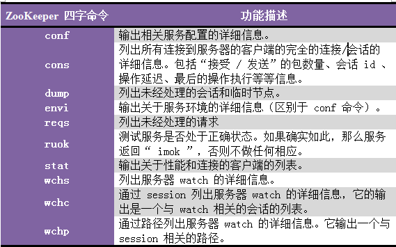

# 笔记
## 1. 分布式协调技术
分布式协调技术 主要用来解决分布式环境当中多个进程之间的同步控制，让他们有序的去访问某种临界资源，防止造成"脏数据"的后果。  
## 2. zookeeper概述
ZooKeeper是一种为分布式应用所设计的高可用、高性能且一致的开源协调服务，它提供了一项基本服务：分布式锁服务。由于ZooKeeper的开源特性，后来我们的开发者在分布式锁的基础上，摸索了出了其他的使用方法：配置维护、组服务、分布式消息队列、分布式通知/协调等。  
ZooKeeper所提供的服务主要是通过：**数据结构+原语+watcher机制**，三个部分来实现的。
## 3. zookeeper数据模型
### 1.节点类型
ZooKeeper中的节点有两种，分别为临时节点和永久节点。节点的类型在创建时即被确定，并且不能改变。  
① **临时节点**：该节点的生命周期依赖于创建它们的会话。一旦会话(Session)结束，临时节点将被自动删除，当然可以也可以手动删除。虽然每个临时的Znode都会绑定到一个客户端会话，但他们对所有的客户端还是可见的。另外，ZooKeeper的临时节点不允许拥有子节点。  
② **永久节点**：该节点的生命周期不依赖于会话，并且只有在客户端显示执行删除操作的时候，他们才能被删除。  
### 2.顺序节点
当创建Znode的时候，用户可以请求在ZooKeeper的路径结尾添加一个递增的计数。这个计数对于此节点的父节点来说是唯一的，它的格式为"%10d"(10位数字，没有数值的数位用0补充，例如"0000000001")。当计数值大于232-1时，计数器将溢出。
## 4. zookeeper服务中的操作
9个基本操作：create、delete、exists、getACL/setACL、getChildren、getData/setData、sync
## 5. Watch触发器
### (1). watch概述
ZooKeeper可以为所有的读操作设置watch，这些读操作包括：exists()、getChildren()及getData()。watch事件是一次性的触发器，当watch的对象状态发生改变时，将会触发此对象上watch所对应的事件。watch事件将被异步地发送给客户端，并且ZooKeeper为watch机制提供了有序的一致性保证。理论上，客户端接收watch事件的时间要快于其看到watch对象状态变化的时间。
## 6.zookeeper的四字命令

```
[root@localhost bin]# echo ruok|nc localhost 2181
imok[root@localhost bin]# echo conf|nc localhost 2181
clientPort=2181
dataDir=/usr/local/zk/data/version-2
dataLogDir=/usr/local/zk/data/version-2
tickTime=2000
maxClientCnxns=60
minSessionTimeout=4000
maxSessionTimeout=40000
serverId=0
[root@localhost bin]# echo cons|nc localhost 2181
 /0:0:0:0:0:0:0:1:46090[1](queued=0,recved=115,sent=115,sid=0x16458973c990000,lop=PING,est=1530494685740,to=30000,lcxid=0xb,lzxid=0x3e1,lresp=1530495725585,llat=0,minlat=0,avglat=0,maxlat=7)
 /0:0:0:0:0:0:0:1:46108[0](queued=0,recved=1,sent=0)
```
